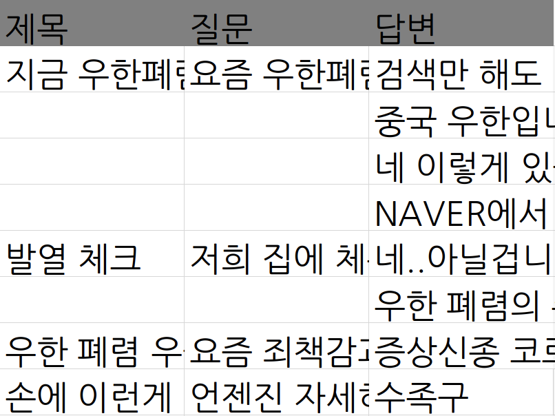

# 네이버 지식인 크롤링

네이버 지식인에서 특정 텍스트를 포함한 질문과 응답을 크롤링하기 위해서 제작했습니다.

## 개선 진행 사항
- 1.1: 기간이 길어져 전체 포스트 개수가 많아지면 특정 시점에서 같은 포스트가 반복이되는 것 같습니다.
네이버 측에서 아마 잦은 크롤링을 방지하기 위해서 만든 것 같으니 기간을 짧게 설정하여 사용하시길 바랍니다.

- 1.2: IP를 우회하는 기능을 추가했습니다. 브라우저를 크롬에서 파이어폭스로 변경했습니다.

## 버전
- 1.0 : 프로젝트 업로드
- 1.1 : 페이지가 특정 범위를 넘어서도 읽히는 문제점 수정
- 1.2 : IP 우회 기능 추가, 랜덤하게 time sleep 하는 기능을 추가.
 
## 개발 환경
Mac OS X 10.14.6

## 라이브러리
- python 3
- BeautifulSoup
- Selenium
- geckodriver
- openpyxl
- tor

## 라이브러리 설치
#### 1. BeautifulSoup

```shell
pip install bs4
```

#### 2. Selenium

```shell
pip install selenium
```

#### 3. webdriver
```
정보) 1.2 버전부터는 사용하지않습니다. 5. geckodriver를 참고해주세요.
```

해당 프로젝트는 크롬에서 크롤링을 하도록 만들었습니다. 다른 브라우저를 사용하실 분들은 다른 블로그에 설명이 잘 되어있으니 설명을 생략하겠습니다.

[여기](https://sites.google.com/a/chromium.org/chromedriver/downloads)를 눌러 현재 사용하는 크롬의 버전과 동일한 버전을 다운로드 받습니다.

다운로드 받은 후 코드 상에서 경로를 설정해야하기 때문에 필요한 곳에 넣어두도록 합시다.
```python
# chrome driver 패스 설정
path = "/Users/taehyung/anaconda3/envs/study/chromedriver"
driver = webdriver.Chrome(path)
```

#### 4. openpyxl
엑셀로 이쁘게 저장하기 위해서 쓰는 라이브러리입니다.
```shell
pip install openpyxl
```

#### 5. geckodriver
[여기](https://github.com/mozilla/geckodriver/releases) 서 파이어폭스와 맞는 버전을 선택해서 다운받고 webdriver와 동일하게 경로를 설정해주세요.

```python
path = "/Users/taehyung/anaconda3/envs/study/geckodriver"
driver = webdriver.Firefox(executable_path=path)
```

webdriver와 다르게 `executable_path` 에 path를 넣어주어야 정상적으로 작동합니다.

## 사용방법 

### IP 우회
[selenium에서 임의의 ip로 크롤링하기 (python, Ubuntu, Firefox)](https://wkdtjsgur100.github.io/selenium-change-ip/) 를 참고했습니다.

```shell
brew install tor
```
로 tor를 설치한 뒤, 
```shell
tor
```
를 실행하면 9050번 포트가 열립니다.

```python
profile = webdriver.FirefoxProfile()
profile.set_preference('general.useragent.override', 'Mozilla/5.0 (Windows NT 10.0; Win64; x64; rv:65.0) Gecko/20100101 Firefox/65.0')
profile.set_preference("network.proxy.type", 1)
profile.set_preference("network.proxy.socks", "127.0.0.1")
profile.set_preference("network.proxy.socks_port", 9050)

path = "/Users/taehyung/anaconda3/envs/study/geckodriver"
driver = webdriver.Firefox(firefox_profile=profile, executable_path=path)
```
그 다음 profile을 설정해 다음과 같이 설정하고 driver를 세팅해줍니다.

### 키워드 세팅
```python
keyword = '우한 폐렴'
```

`keyword`에 찾길 원하는 텍스트를 입력합니다.

### 기간 설정
```python
# 크롤링 시작 일자
f = '2019.02.05'
# 크롤링 종료 일자
t = '2020.02.05'
```

`f`와 `t` 는 각각 기간을 나타내며, 서칭하고 싶은 기간을 설정합니다.

### 실행 방법
```shell
python3 project.py
```

## 결과
이후 프로젝트를 시작하면, 크롬이 켜지면서 하나하나 읽기 시작하고 엑셀로 저장합니다. 



